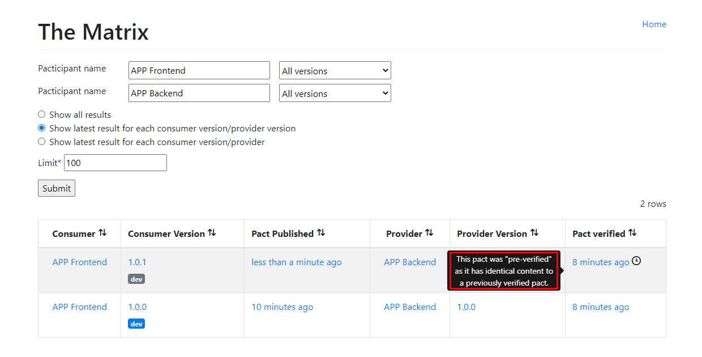

# Executing the Showcase:
- Firt, let's start the Pact Broker using the Docker-compose:
```sh
docker-compose up -d
```
The Pack Brocker UI can be opened through the URL `http://localhost:9292/`.  

- Then, let's execute the tests on Consumer side:
```sh
npm --prefix ./consumer run test:consumer
```
After that the pact file will be generated, under the path:
`consumer/tests/contract/pacts`  

- After generating the pact file, it should be sent to the Pact Broker:
```sh
npm --prefix ./consumer run publish
```
After publishing it, the [Pack Broker UI](http://localhost:9292/) must show the pact.  

- If we consider a production environment, in order to check if the Consumer application can be deployed/released, the "Can I Deploy" utility can be used. By running the following command, the pact will be checked and will result in a failure because the pact it's not verified:
```sh
docker run --rm pactfoundation/pact-cli:latest broker can-i-deploy --broker-base-url=host.docker.internal:9292 --pacticipant="APP Frontend" --latest
```

The output will be:
```sh
Computer says no ¯_(ツ)_/¯

CONSUMER     | C.VERSION | PROVIDER    | P.VERSION | SUCCESS? | RESULT#
-------------|-----------|-------------|-----------|----------|--------
APP Frontend | 1.0.0     | APP Backend | ???       | ???      |

WARN: For production use of can-i-deploy, it is recommended to specify the environment into which you are deploying. Without the environment, this result will not be reliable.
WARN: For production use of can-i-deploy, it is recommended to specify the version number (rather than latest tag or branch) of each pacticipant to avoid race conditions.
There is no verified pact between the latest version of APP Frontend (1.0.0) and the latest version of APP Backend (no such version exists)
```

- Let's execute the tests on the Provider side, this will verify the pact with the Consumer:
```sh
dotnet test ./provider/Provider.Api.Web.Tests/Provider.Api.Web.Tests.csproj
```
*The test passing on the Provider side means a "green light", let's say on a pipeline.*  
The result will be something like:
```sh
Passed!  - Failed:     0, Passed:     1, Skipped:     0, Total:     1, Duration: 12 s - Provider.Api.Web.Tests.dll (ne
```

- The "Can I Deploy" utility can be executed again, the result will be positive, as the pact it's now verified.
```sh
docker run --rm pactfoundation/pact-cli:latest broker can-i-deploy --broker-base-url=host.docker.internal:9292 --pacticipant="APP Frontend" --latest
```

The result will be something like:
```sh
Computer says yes \o/ 

CONSUMER     | C.VERSION | PROVIDER    | P.VERSION | SUCCESS? | RESULT#
-------------|-----------|-------------|-----------|----------|--------
APP Frontend | 1.0.0     | APP Backend | 1.0.0     | true     | 1

VERIFICATION RESULTS
--------------------
1. http://host.docker.internal:9292/pacts/provider/APP%20Backend/consumer/APP%20Frontend/pact-version/0856e326bcc1e280cd2fa7aa9aaa5ed41f9bb020/verification-results/200 (success)

WARN: For production use of can-i-deploy, it is recommended to specify the environment into which you are deploying. Without the environment, this result will not be reliable.
WARN: For production use of can-i-deploy, it is recommended to specify the version number (rather than latest tag or branch) of each pacticipant to avoid race conditions.
All required verification results are published and successful
```

*On the Consumer side this would be the "green light".*

Other scenarios:
- In case the Consumer publishes a new version of the pact, without any changes, even without the contract verification at the Provider side, the "Can I Deploy" will provide a positive output.
How to change it:
    - Open the "publish.js" and change the value of `consumerVersion`.
    - Execute again the commands to run Consumer tests, and publish the pact.
    - Run the "Can I Deploy" again, the result will be positive.
    - At the Pact Broker page, the verified column will show a description about it:
    
- If something changed in the Provider:
    - Change the "ClientsController.cs" (line 56) to: `var response = Request.CreateResponse(HttpStatusCode.OK, client);`.
    - Execute again the command to run Provider tests. The tests will fail with the reason in the output:
    ```sh
    Failures:
    
    1) Verifying a pact between APP Frontend and APP Backend Given I create a new Client a equest to create a new client with First Name and Last Name with POST /clients returns a response which has status code 201
      Failure/Error: expect(response_status).to eql expected_response_status

        expected: 201
             got: 200

        (compared using eql?)

    3 interactions, 1 failure

    Failed interactions:

    To re-run just this failing interaction, change the verify method to '.Verify(description: "a equest to create a new client with First Name and Last Name", providerState: "I create a new Client")'. Please do not check in this change! # 
    A equest to create a new client with first name and last name given I create a new Client
    INFO: Verification results published to http://localhost:9292/pacts/provider/APP%20Backend/consumer/APP%20Frontend/pact-version/0856e326bcc1e280cd2fa7aa9aaa5ed41f9bb020/verification-results/203
    ```
    - Running the Provider tests, publishing and the "Can I Deploy" again will result into a failure.
    *If the Consumer changes something on their side that affects the Pact, the outcome would be the same*